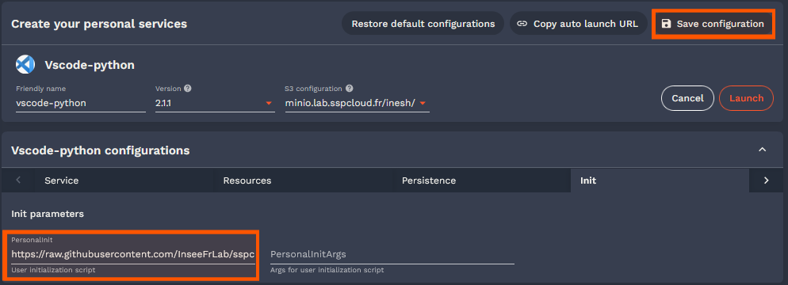

#  Initialization Scripts for Interactive Services

Welcome to the Initialization Scripts Repository for the Onyxia platform! This repository provides example scripts that can be used to configure and initialize various [interactive services](https://github.com/InseeFrLab/helm-charts-interactive-services), such as RStudio, VSCode, or Jupyter Notebooks, when they are launched on the [Onyxia](https://www.onyxia.sh/) platforms.

## How to use
1. Make sure the repository containing your initialization script is public

2. Get the [raw url](https://docs.github.com/en/repositories/working-with-files/using-files/viewing-a-file#viewing-or-copying-the-raw-file-content) of the script you want to initialize your service with or, preferably, create your own initialization script inspired by this repository.

3. When launching your service on the platform, configure your service. Go to the Init tab and fill in the url of your script.



4. You may want to save your configuration to find it later and avoid these steps.

5. Launch your service and enjoy

## Contributing 

Contributions are welcome, feel free to submit pull requests 😊 
Please, make sure the code is well documented and respect the following template: 

```
#!/bin/sh

# This init script is used for .... 
# Expected parameters : 
# Indicate None if parameters are not needed, else :
#   - parameter1 : brief description
#   - parameter2 : brief description


```

## Contact

For questions or support, please open an issue in this repository or contact the maintainers.
